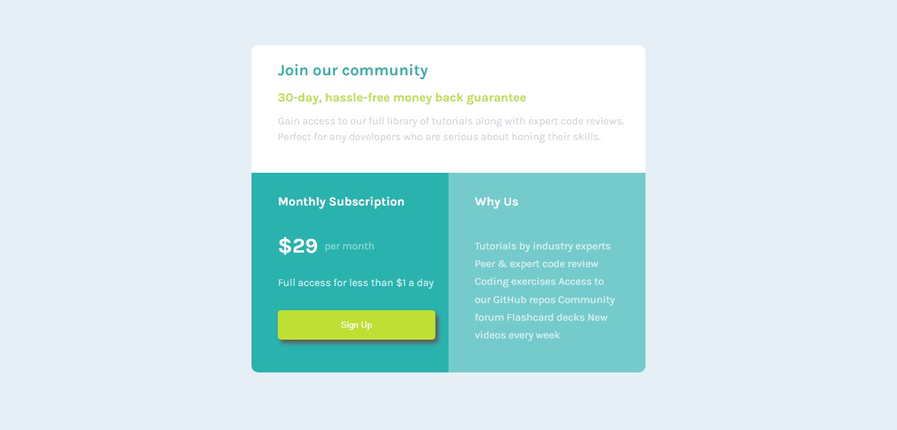

# Frontend Mentor - Single price grid component solution

This is a solution to the [Single price grid component challenge on Frontend Mentor](https://www.frontendmentor.io/challenges/single-price-grid-component-5ce41129d0ff452fec5abbbc). Frontend Mentor challenges help you improve your coding skills by building realistic projects. 

## Table of contents

- [Overview](#overview)
  - [The challenge](#the-challenge)
  - [Screenshot](#screenshot)
  - [Links](#links)
- [My process](#my-process)
- [Author](#author)

## Overview

### The challenge

Users should be able to:

- View the optimal layout for the component depending on their device's screen size
- See a hover state on desktop for the Sign Up call-to-action

### Screenshot

### Links

- Solution URL: [github](https://github.com/obinneji/single-price-grid-component-master)
- Live Site URL: [live url](https://obinneji.github.io/single-price-grid-component-master/)

### Built with

-  HTML5
- CSS custom properties
- Flexbox
- CSS Grid

## Author

- Website - [obinneji](https://www.github.com/obinneji)
- Frontend Mentor - [@obinnei](https://www.frontendmentor.io/profile/obinneji)
- Twitter - [@francisobinneji](https://www.twitter.com/francisobinneji)

